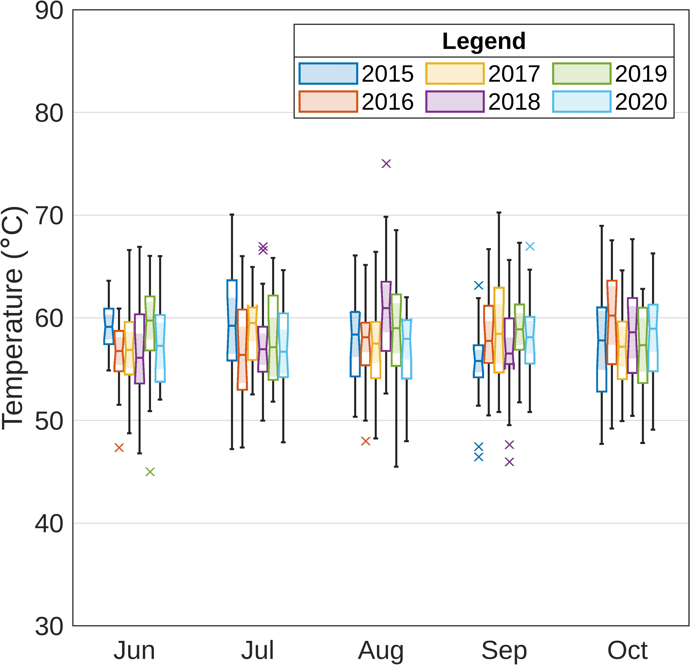

# groupedSpacedBoxchart
Boxcharts with space between groups (MATLAB function).

## Purpose
Inspired by Sudhee's question on MATLAB Answers (https://www.mathworks.com/matlabcentral/answers/2120996), the `groupedSpacedBoxchart` function is a modified version of the base function `boxchart`. The modified function adds extra space between grouped data in a boxchart visualization, thereby making it easier to distinguish between the groups.



## Documentation
**Syntax**

  * ```groupedSpacedBoxchart(dataTable,x,y,groups)```

  * ```groupedSpacedBoxchart(...,varargin)```

  * ```axHandle = groupedSpacedBoxchart(...)```
 
 **Inputs**

  * `dataTable` - Table containing your original data

  * `x` - Name of XData variable (ex. 'Month')

  * `y` - Name of YData variable (ex. 'Temperature')

  * `groups` - Name of the variable you wish to group the data by (ex. 'Year')

  * `varargin` - (Optional) name/value pairs compatible with the boxchart() function
 
 **Outputs**

  * `axHandle` - Chart axes handle
 
 **Examples**

 ```matlab
  load temperature_data
  plt = groupedSpacedBoxchart(data,'Month','TemperatureF','Year');
 
  % With optional inputs
  plt2 = groupedSpacedBoxchart(data,'Month','TemperatureF','Year',...
         'BoxWidth',0.5,'MarkerStyle','x','notch','on');
  ylim([20 100]), ylabel('Temperature (\circF)')
  legend(categorical(unique(data.Year)))
 ```
